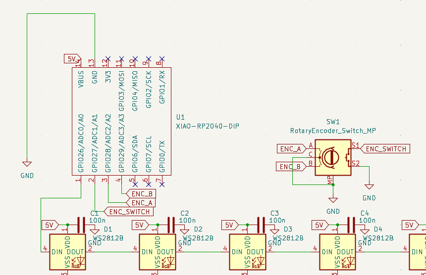
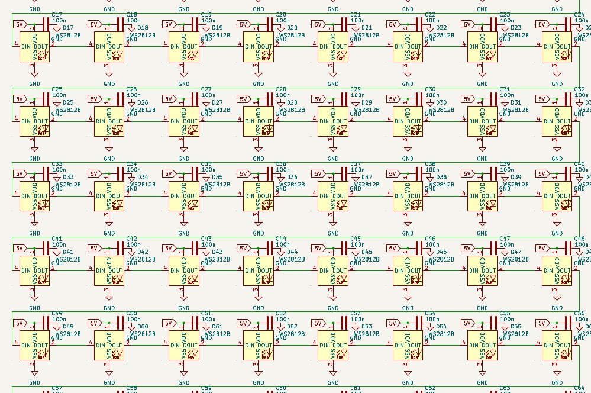
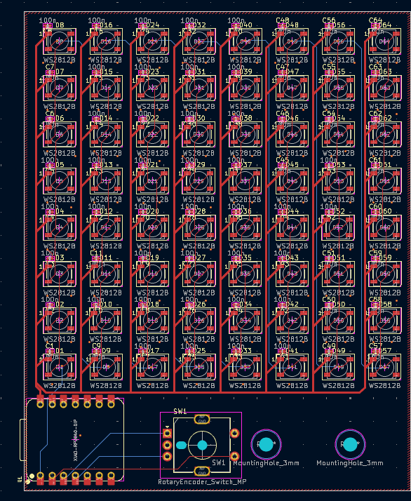
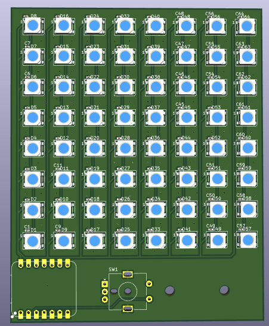
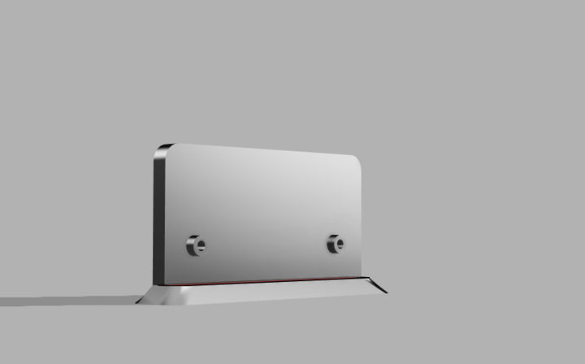
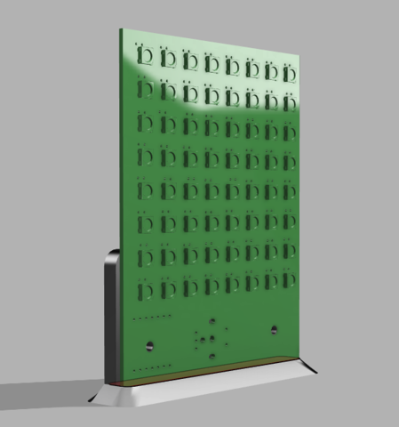

# Day 1 - 2 Hours
Worked on the schematic to get the WS2812Bs and their capacitors lined up and created the matrix. Spent some time getting the footprint for the Xiao-rp2040 but it was necessary to minimize the footprint of the project. The Schematic was kind of quick with calculated copy-pasting parts of the matrix, and was overall completed in 30 minutes.
The PCB took a bit longer as I had to locate the footprints and trace each LED to its decoupling capacitor. The capacitors might not line up properly but they do end up looking clean enough. I created a ground zone and routed everything together. It's fortunate that I ran DRC because I had missed connecting around 5 LEDs together, which would have broken the chain and rendered the project useless.

# Day 2 - 1 Hour
I decided to use QMK-Vial to code the thing, because the Vial GUI will allow me to easily piggyback off the effects with QMK. Also, it will make it easier for me to control the rotary encoder, allowing me to switch effects, brightness and speed on the go!
I created a new QMK keyboard and only added the matrix switch as direct pin. I added the rotary encoder and RGB into my `info.json` to circumvent writing too much code.

# Day 3 - 2 Hours
Completed Vial-QMK code for the matrix and spent a lot of time debugging the compiler. As it turns out, the VSCode integrated terminal does not co-operate with QMK. Eventually, I managed to compile using QMK-MSYS and getting the .uf2 file. The code basically makes the device seem like an HID device but the keymaps are only linked to the RGB Matrix feature, allowing me to modify the RGB effects over the Vial GUI as I would to a regular keyboard.

# Day 4 - 2 Hours
Modelled the holder in Fusion 360 and rendered it with the PCB. It is a simple stand with 2x M3 Screws to hold the PCB in place. Also replaced all the 0402 capacitors with THT ones to save costs on PCB Assembly, since I can solder it myself.

