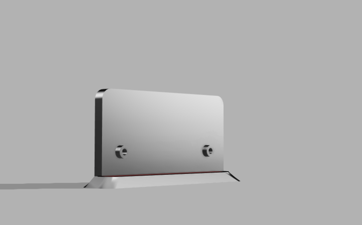

# deskrgbm
desktop rgb matrix for the vibes

deskrgbm has a xiao-rp2040 and a WS2812B matrix that can be controlled using QMK-Vial. It is a simple RGB Matrix that can display effects and be used as a desktop ornament. It also features a rotary encoder to control the effects, brightness and speed of the RGB Matrix. The code is written in QMK and can be easily modified using the Vial GUI.

The PCB is very easy to assemble and uses THT Capacitors to be beginner friendly. It is a simple 2 Layer board that does not cost too much to manufacture. The holder is designed in a way such that you can easily use heatsunk threaded inserts and M3 screws to hold the PCB in place. It is intended to print in PLA to be cost effective. \

## Bill of Materials

|Product       |Price|Link                                                                                               |
|--------------|-----|---------------------------------------------------------------------------------------------------|
|PCB           |42   |https://pcbpower.com/                                                                              |
|WS2812B       |5    |https://www.ktron.in/product/ws2812b-rgb-smd-5050-led/                                             |
|THT Capacitors|5    |https://sharvielectronics.com/product/100nf-250v-0-1uf-polyester-film-capacitor-7-5mm              |
|Xiao RP2040   |7    |[already have this]                                                                                |
|Rotary encoder|3    |[already have this]                                                                                |
|Total         |52   |                                                                                                   |
